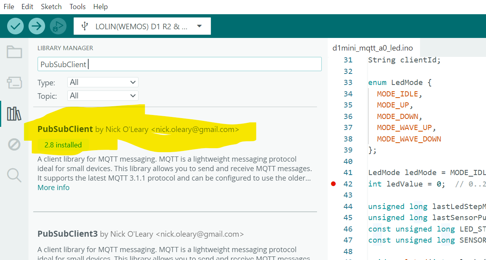
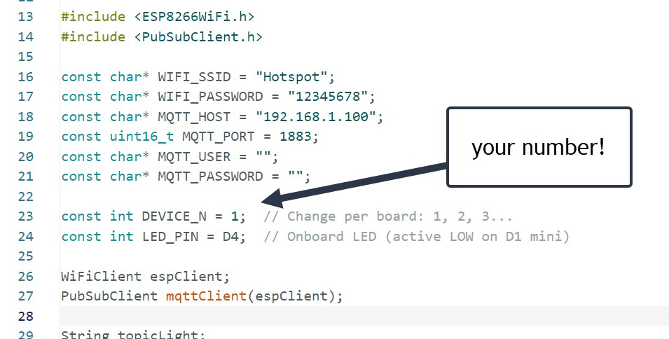
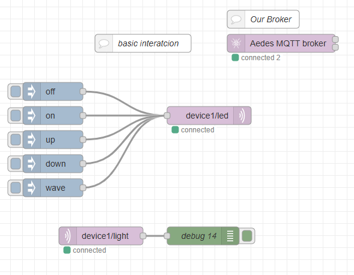
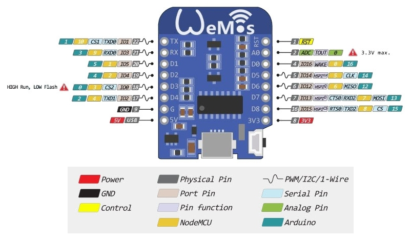

# My Short PhyComp Lesson at IED Milan 2026

Short physical computing lesson materials for IED Milan 2026 (Design for Commons, 4th-5th year).

## Internet in the classroom

SSID: `Hotspot`
PASS: `12345678`

## Project Structure

- `arduino/` - Arduino IDE example for ESP8266 D1 mini
- `esphome/` - ESPHome YAML example for ESP8266 D1 mini
- `node-red/` - Node-RED JSON examples for visualisation and control

Attention! You can choose whether to program the boards using Arduino or ESPHome. It's up to you.

## Arduino

### Install Arduino IDE

1. Download Arduino IDE from the [official Arduino website](https://www.arduino.cc/en/software).
2. Install it with default settings.
3. Open Arduino IDE once to complete first-time setup.

### Install ESP8266 Board Support

1. Open Arduino IDE and go to `File > Preferences`.
2. In `Additional Boards Manager URLs`, add:
   - `http://arduino.esp8266.com/stable/package_esp8266com_index.json`
3. Go to `Tools > Board > Boards Manager`.
4. Search for `esp8266` and install `esp8266 by ESP8266 Community`.
5. Select your board from `Tools > Board` (for D1 mini, usually `LOLIN(WEMOS) D1 R2 & mini`).
6. (for MQTT examples) `sketch > include libraries > manage libraries`  search for  `PubSubClient` and install

### Example Code

Reference codes:

- `arduino/d1mini_a0_serial/d1mini_a0_serial.ino` - reads `A0` and prints values on Serial.
- `arduino/d1mini_blink_d4/d1mini_blink_d4.ino` - blinks onboard LED on `D4`.
- `arduino/d1mini_fade_d4/d1mini_fade_d4.ino` - PWM fade on onboard LED (`D4`).
- `arduino/d1mini_mqtt_a0_led/d1mini_mqtt_a0_led.ino` - MQTT with `PubSubClient`:
  - publishes `A0` on `deviceN/light`
  - listens on `deviceN/led` for:
    - `on` -> LED on
    - `off` -> LED off
    - `up` -> fade 0 to 255 with 10 ms steps
    - `down` -> fade 255 to 0 with 10 ms steps
    - `wave` -> fade 0 to 255 to 0 with 10 ms steps

## ESPHome

### Install ESPHome

You can install ESPHome in two common ways:

- **With Home Assistant Add-on**
  1. Open Home Assistant.
  2. Go to `Settings > Add-ons`.
  3. Install and start the `ESPHome` add-on.

- **With Python (CLI)**
  1. Install Python 3.
  2. Run:
     - `pip install esphome`
  3. Verify installation:
     - `esphome version`

### Example Configuration

Reference codes:

- `esphome/d1mini_a0_serial.yaml` - reads `A0` and logs values.
- `esphome/d1mini_blink_d4.yaml` - blinks onboard LED on `D4`.
- `esphome/d1mini_fade_d4.yaml` - PWM fade on onboard LED (`D4`).
- `esphome/d1mini_mqtt_a0_led.yaml` - MQTT behavior:
  - publishes `A0` on `deviceN/light`
  - listens on `deviceN/led` for:
    - `on` -> LED on
    - `off` -> LED off
    - `up` -> fade 0 to 255 with 10 ms steps
    - `down` -> fade 255 to 0 with 10 ms steps
    - `wave` -> fade 0 to 255 to 0 with 10 ms steps

## Node-RED

### Install Node-RED

1. [Install Node-RED on your PC](https://nodered.org/docs/getting-started/local)
2. [Install Node.js if needed](https://nodejs.org/en/download)

Once installed, open a command prompt and run the following command to ensure Node.js and npm are installed correctly.

- Powershell: `node --version; npm --version`  
- cmd: `node --version && npm --version`
- terminal(macos): `node --version; npm --version`

You should receive back output that looks similar to:

`v18.15.0`
`9.5.0`

### Install node-red 

`npm install -g node-red`

### Launch Node-RED

`node-red`

3. an MQTT broker locally installed, we are using [Aedes as a Node-RED node](https://flows.nodered.org/node/node-red-contrib-aedes)
4. Don't forget to install the [Node-RED Dashboard 2](https://dashboard.flowfuse.com/)

### Reference files

Currently no Node-RED flow JSON has been added to this repository yet.

## The boards

### ESP8266 as Wemos D1 mini

